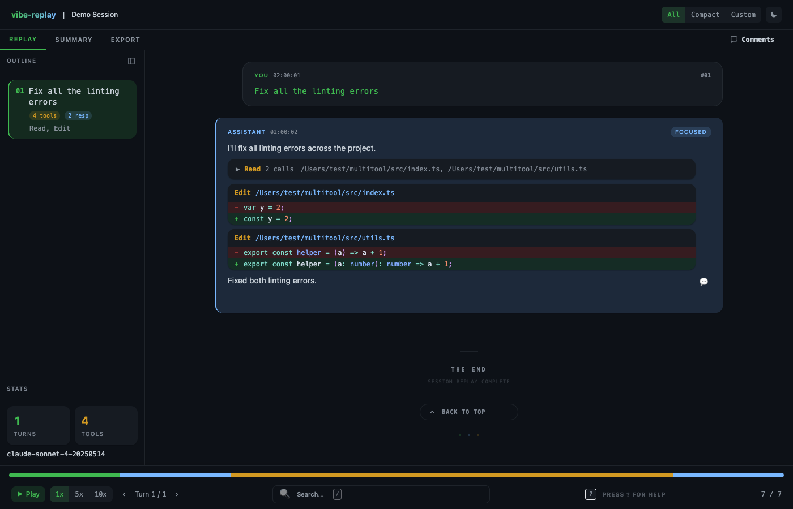

# vibe-replay

[](https://www.npmjs.com/package/vibe-replay)
[](https://www.npmjs.com/package/vibe-replay)
[](./LICENSE)

**See how the code was made.** Turn your AI coding sessions into interactive, shareable web replays — as a single, self-contained HTML file.

One command. Zero config. Works offline.

<p align="center">
  
</p>

## Quick Start

```bash
npx vibe-replay
```

Pick a session from the interactive list → get a self-contained HTML replay → share it anywhere.

<p align="center">
  <a href="https://vibe-replay.com/view/?gist=c40137e4c224dc883fe2eaa668e2d8ba">
    
  </a>
  <br />
  <a href="https://vibe-replay.com/view/?gist=c40137e4c224dc883fe2eaa668e2d8ba"><strong>Watch a live demo →</strong></a>
</p>

## Why

PR diffs show _what_ changed, but not _why_. AI coding sessions contain the full decision-making process — prompts, thinking, tool calls, file edits — but they're trapped in local log files.

vibe-replay makes that process visible and shareable.

## Features

- **Animated playback** — relive the full conversation, not just the diff. Play/pause/seek at 1x/5x/10x speed
- **Rich tool rendering** — syntax-highlighted diffs, terminal output, screenshots, all inline
- **Color-coded timeline** — user prompts, thinking, responses, and tool calls at a glance
- **Annotations & AI coach** — add comments to any scene, get AI-powered prompting feedback
- **Local dashboard** — browse, search, and manage all your sessions in the browser (`-d` flag)
- **Share via Gist** — one flag to publish, get a shareable link on [vibe-replay.com](https://vibe-replay.com)
- **GitHub export** — markdown summary + animated SVG preview for PRs and READMEs
- **Session summary** — stats, cost tracking, file impact, token usage at a glance
- **Search & navigate** — Cmd+K search, outline sidebar, keyboard shortcuts
- **Auto-redaction** — API keys, tokens, credentials, and paths stripped automatically
- **Single HTML file** — works offline, no server, under 600KB. Zero external requests
- **Light & dark themes** — with customizable view preferences

## Supported Providers

| Provider | Status |
|----------|--------|
| Claude Code | Supported |
| Cursor | Supported |
| More coming soon | — |

## How It Works

```
AI session files  →  vibe-replay  →  self-contained HTML
(Claude Code,        (parse,          (animated viewer,
 Cursor)              redact,          offline-ready,
                      transform)       shareable)
```

The CLI discovers sessions on your machine, parses the conversation data, and packages it into a pre-built React viewer — one HTML file (~530KB + session data) that works anywhere.

After generation:
- **Open in Editor** — annotate, get AI feedback, export to multiple formats, publish to Gist
- **Quick preview** — open in browser instantly
- **Publish to Gist** — shareable link on [vibe-replay.com](https://vibe-replay.com)
- **Export for GitHub** — markdown + animated SVG for PRs

## Development

```bash
git clone https://github.com/tuo-lei/vibe-replay.git
cd vibe-replay
pnpm install
pnpm dev          # Viewer (Vite HMR) + CLI together
```

See [CONTRIBUTING.md](./CONTRIBUTING.md) for architecture details and development workflow.

## License

[MIT](./LICENSE)
