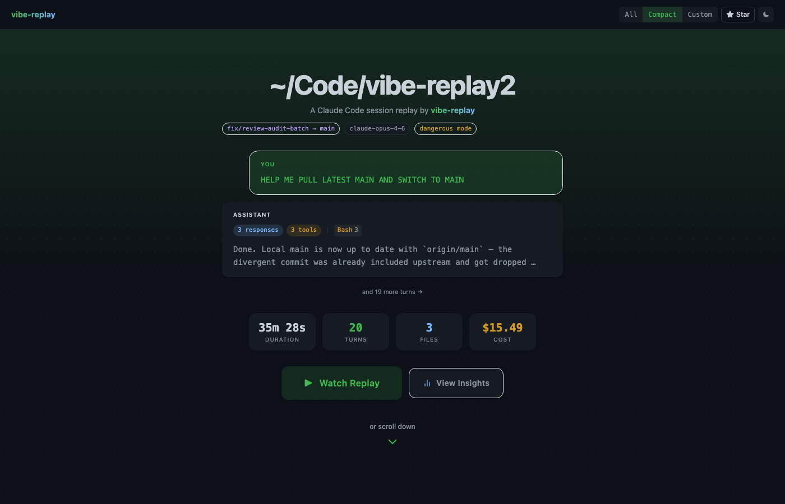
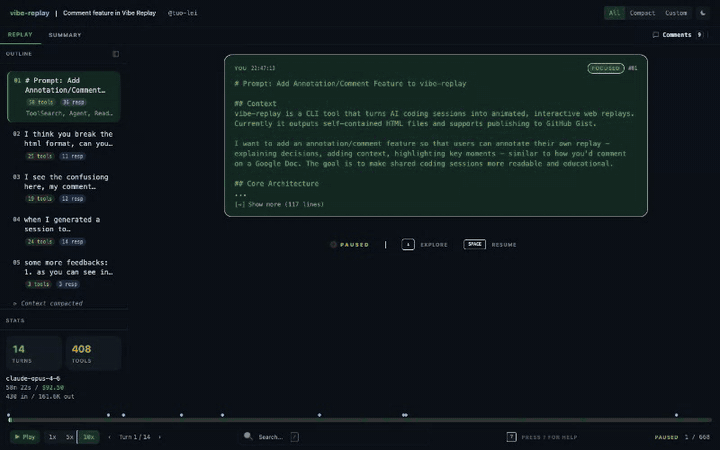
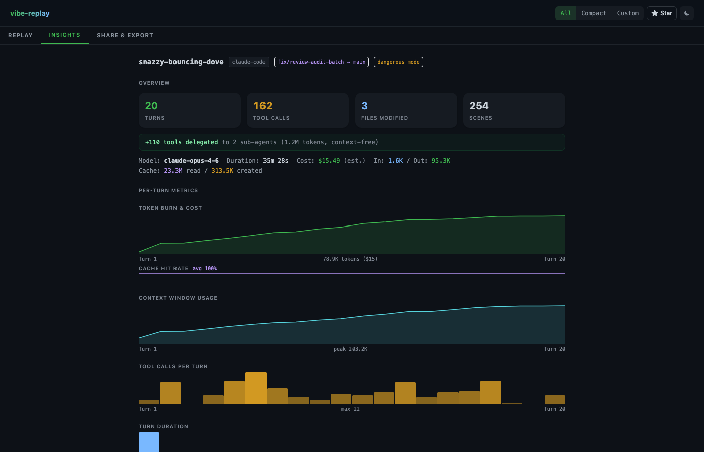
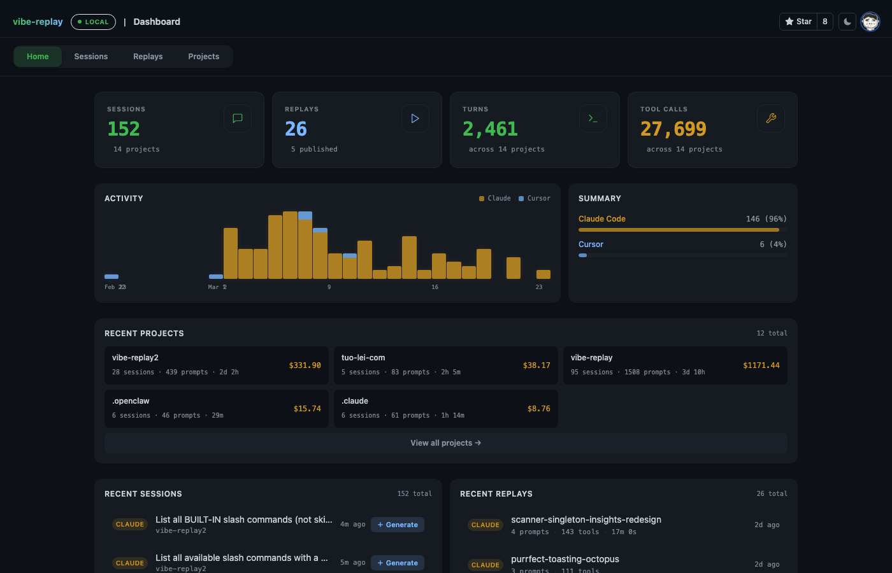
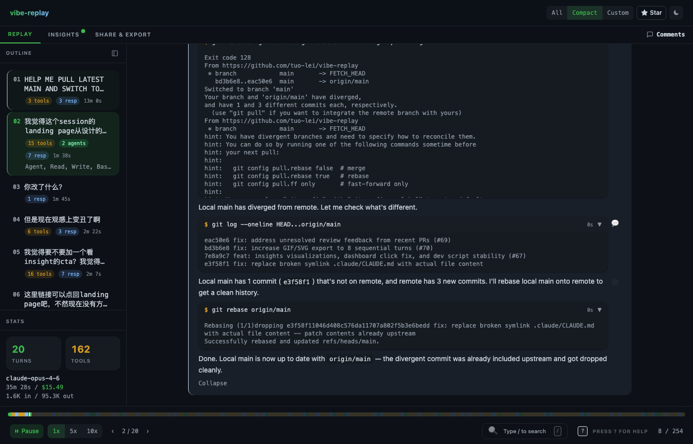

# vibe-replay

[](https://www.npmjs.com/package/vibe-replay)
[](https://www.npmjs.com/package/vibe-replay)
[](./LICENSE)

Turn Claude Code and Cursor sessions into shareable, interactive replays.

**PR diffs show _what_ changed. vibe-replay shows _why_** — every prompt, every thought, every tool call, in one shareable file. One command. Zero config. Works offline.

<p align="center">
  <video src="https://github.com/user-attachments/assets/PLACEHOLDER" width="800" autoplay loop muted playsinline>
    
  </video>
</p>

> **[Watch a live demo &rarr;](https://vibe-replay.com/view/?gist=c40137e4c224dc883fe2eaa668e2d8ba)**

## Quick Start

```bash
npx vibe-replay
```

Pick a session from the interactive list, get a self-contained HTML replay, share it anywhere.

<details>
<summary>See the CLI in action</summary>
<p align="center">
  
</p>
</details>

## What You Get

### Interactive Replay with Session Landing

Every replay opens with a session overview — first prompt, key stats, and one-click access to the full replay or insights panel.

<p align="center">
  <a href="https://vibe-replay.com/view/?gist=c40137e4c224dc883fe2eaa668e2d8ba">
    
  </a>
</p>

### Session Insights

Auto-generated analytics for every session: token burn & cost over time, context window usage, cache hit rates, tool call distribution, and per-turn breakdowns.

<p align="center">
  
</p>

### Local Dashboard

Browse, search, and manage all your sessions across projects. See activity heatmaps, cost totals, and project-level analytics at a glance. Launch with `npx vibe-replay -d`.

<p align="center">
  
</p>

### Animated Playback

Step through prompts, thinking blocks, tool calls, and diffs with animated playback. Three view modes — All (full detail), Compact (condensed), and Custom (your filters). Navigate with the outline sidebar or timeline controls.

<p align="center">
  
</p>

## Features

- **Zero config** — one command, no setup, no account. Works instantly with existing sessions
- **Single HTML file** — self-contained, works offline, zero external requests. Drop it in Slack, email it, open it anywhere
- **Claude Code + Cursor** — both providers auto-discovered, including multi-file and resumed sessions
- **Session insights** — token usage, cost tracking, cache hit rates, context window charts, tool call breakdown per session
- **Local dashboard** — browse all sessions across projects, activity heatmaps, project-level analytics (`-d` flag)
- **Animated playback** — step through prompts, thinking, tool calls, and diffs at your own pace. Three view modes (All / Compact / Custom)
- **Sub-agent visualization** — see delegated tool calls and sub-agent trees rendered inline
- **Add comments** — leave notes on any scene. Comments persist in the HTML and travel with the replay
- **Share & export** — publish to GitHub Gist for a shareable link, or export as markdown summary + animated SVG for PRs
- **Secret redaction** — API keys, tokens, and common patterns are detected and masked before sharing
- **Rich rendering** — syntax-highlighted diffs, terminal output, thinking blocks, tool call durations, color-coded timeline

<p align="center">
  
</p>

## Supported Providers

| Provider | Status |
|----------|--------|
| Claude Code | Supported |
| Cursor | Supported (SQLite + JSONL, auto-discovered) |
| More coming soon | — |

## How It Works

```
AI session files  →  vibe-replay  →  self-contained HTML
(Claude Code,        (discover,       (animated viewer,
 Cursor)              parse,           insights panel,
                      redact,          offline-ready,
                      transform)       shareable)
```

The CLI auto-discovers sessions on your machine, parses conversation data from all sources, and packages everything into a pre-built React viewer — one HTML file that works anywhere.

**After generation:**
- **Open in Editor** — annotate scenes, get AI feedback, export to multiple formats
- **Quick preview** — open in browser instantly
- **Publish to Gist** — shareable link on [vibe-replay.com](https://vibe-replay.com)
- **Export for GitHub** — markdown + animated SVG for PRs

## Use Cases

- **Vibe coding review** — replay your AI-assisted coding sessions to spot prompting patterns and improve your workflow
- **Team knowledge sharing** — show teammates _how_ you built something, not just the final diff
- **PR context** — attach a replay link to PRs so reviewers understand the reasoning behind changes
- **Teaching & onboarding** — create replayable walkthroughs of real coding sessions for documentation or training
- **Cost tracking** — see exactly how many tokens each session burns, track costs across projects

## Development

```bash
git clone https://github.com/tuo-lei/vibe-replay.git
cd vibe-replay
pnpm install
pnpm dev              # Viewer (Vite HMR) + CLI (auto-restart) — full HMR
pnpm dev:website      # Website (Astro HMR) + Viewer (Vite HMR)
```

See [CONTRIBUTING.md](./CONTRIBUTING.md) for architecture details and development workflow.

## License

[MIT](./LICENSE)
