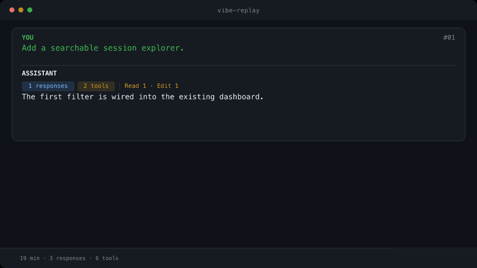
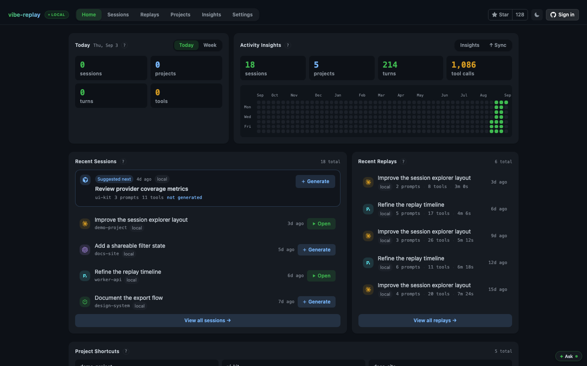
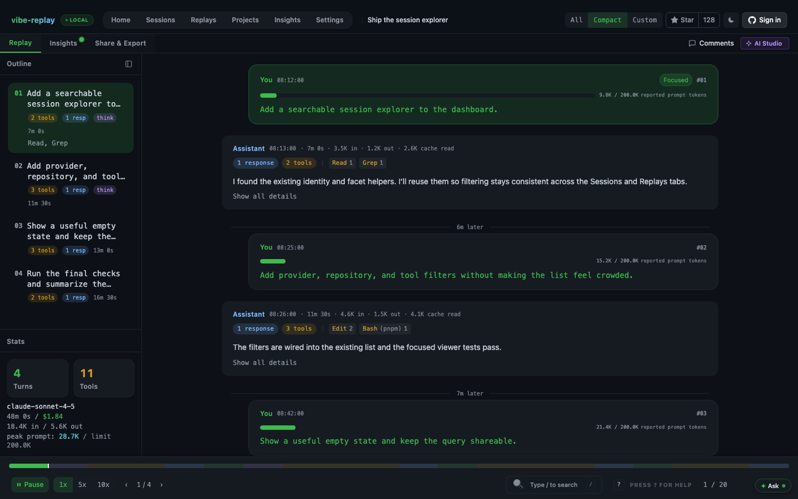
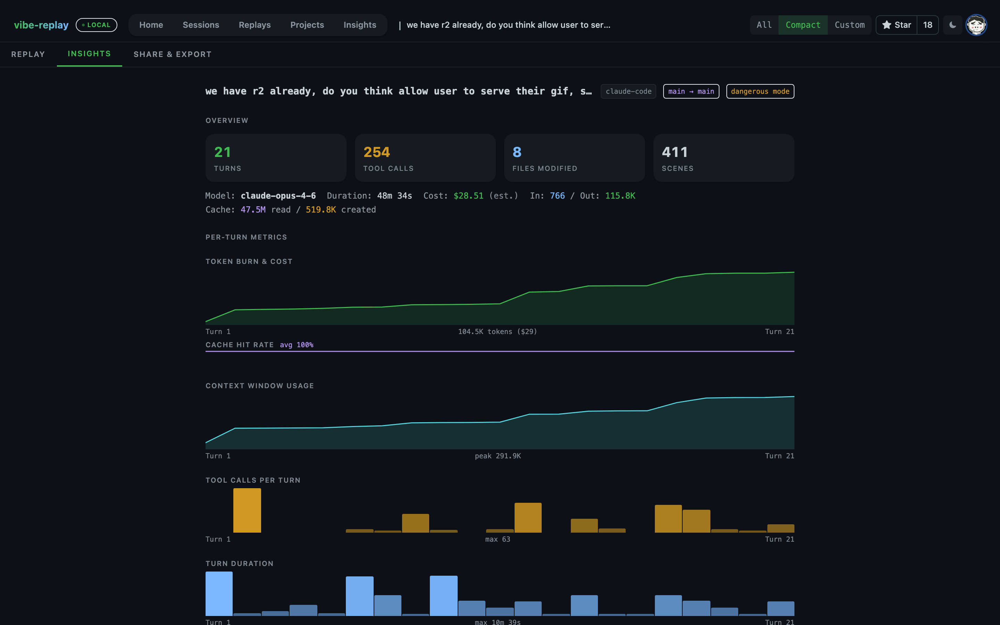
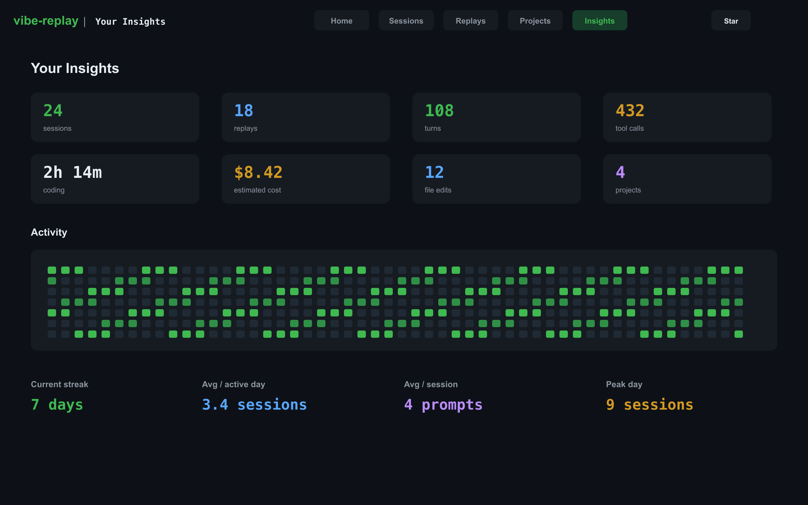

# vibe-replay

[](https://www.npmjs.com/package/vibe-replay)
[](https://www.npmjs.com/package/vibe-replay)
[](./LICENSE)

Turn Claude, Cursor, Codex, OpenCode, Hermes, Pi, and Grok Bot sessions into shareable, interactive replays — then analyze them with local insights, AI Studio, and Ask Replay.

### The problem

AI agents write code in long, complex sessions — dozens of tool calls, hundreds of file edits, thousands of lines of reasoning. When the session ends, all that context disappears. Your PR diff shows _what_ changed, but reviewers can't see _why_. Teammates can't learn from your prompting. You can't even replay your own session next week.

### The fix

One command. One self-contained HTML file. Every prompt, every thought, every tool call — animated, searchable, and ready to share.

```bash
npx vibe-replay
```

> Also available as a [Claude Code plugin](#claude-code-plugin) — your agent generates replays automatically during PR creation.

> **[Watch a live demo &rarr;](https://vibe-replay.com/view/?gist=c40137e4c224dc883fe2eaa668e2d8ba)**

<p align="center">
  
</p>


## What You Get

### All your sessions, one place

Launch with `npx vibe-replay -d` and see every Claude, Cursor, Codex, OpenCode, Hermes, Pi, and Grok Bot session across all projects — with a daily activity snapshot, activity heatmaps, cost totals, and project analytics. Search sessions, filter by git repo, tool, MCP server/tool, skill, or context compaction, expand any session to see its own tool/MCP breakdown, and generate any replay in one click.

<p align="center">
  
</p>

### Remote SSH sources

The dashboard can also include JSONL sessions from any OpenSSH-compatible host. Add targets from the
dashboard's **Settings** tab, or directly in `~/.vibe-replay/config.json`:

```json
{
  "remoteSources": [
    {
      "id": "remote-dev",
      "label": "Remote dev",
      "sshHost": "devbox",
      "providers": ["codex", "claude-code", "pi"]
    }
  ]
}
```

The Settings form validates source ids, provider selections, and connection timeouts, and can run a
bounded SSH probe before you refresh the catalog. It uses your existing OpenSSH keys, aliases, and
ProxyJump configuration; credentials are never stored by vibe-replay.

`sshHost` can be a normal hostname or an alias from `~/.ssh/config`, so existing keys, agents, `ProxyJump`, and `ProxyCommand` configuration continue to work. No private key or password belongs in this file. Remote Codex, Claude Code, and Pi JSONL files are copied into a per-target local cache and parsed by the same providers as local sessions; source cards show the configured location label. A transcript that is still being written is kept at its last stable cached version instead of making the whole SSH source unavailable. Codex titles match `/resume`: explicit names from `session_index.jsonl` take precedence over the read-only `state_5.sqlite` title. The live database and WAL are never copied. Hosts with Python `sqlite3` or the `sqlite3` CLI unavailable still use cached metadata. Sessions whose source is missing, unreadable, or contains no meaningful human prompt remain visible with an explicit status and cannot be generated into an empty replay. Remote repository identity is retained for local filtering but omitted from shareable replay data. Remote Live mode is intentionally unavailable. Remote sessions stay in local insights and are excluded from optional cloud insight sync.

### Watch the full replay

Pick a session and step through every prompt, thinking block, tool call, and code diff with animated playback. Three view modes — All, Compact, and Custom.

<p align="center">
  <a href="https://vibe-replay.com/view/?gist=c40137e4c224dc883fe2eaa668e2d8ba">
    
  </a>
</p>

### Deep insights for every session

Auto-generated analytics: token burn & cost over time, context window usage, cache read share, tool call distribution, model breakdown, and per-turn breakdowns.

<p align="center">
  
</p>

The Insights **Coverage** section separates scan completion from metric availability and shows
provider-level precision for invocations, MCP calls, tokens, cache reads/writes, and compactions.
“Uncached / miss” is a derived prompt metric (`uncached input + cache writes`); providers do not
share one universal cache-miss counter. Cursor snapshot totals are marked estimated, and Cursor
compactions are lower bounds because its local store can retain only the latest summary.

When providers persist context-composition metadata, a replay's Insights view also breaks out the
system prompt, tool definitions, rules, skills, MCP definitions, subagents, summaries, and
conversation. Cursor supplies provider-estimated tokens for its latest snapshot; Cowork, Codex,
and Pi expose privacy-safe byte/count aggregates from persisted metadata. Raw system prompts, tool
descriptions, and schemas are never copied into this breakdown.

### Your AI coding wrapped

GitHub-style activity heatmap, streaks, weekly trends, top projects, model usage, and cost tracking across all your sessions. See how your coding patterns evolve over time.

<p align="center">
  
</p>

### AI Studio and Ask Replay

Go beyond playback without sending your session history to a hosted service. **AI Studio** uses the
embedded Pi runtime to analyze a replay, translate it, or adjust its tone with the provider you
choose — including OpenAI-compatible endpoints and local gateways. **Ask Replay** is a read-only
assistant for searching sessions, explaining usage and Insights, inspecting scenes and overlays, and
jumping to stable dashboard or replay links. It never edits files, publishes, or mutates data on its
own; any requested action is handed back to you for review.

## Claude Code Plugin

vibe-replay is also available as a [Claude Code plugin](https://code.claude.com/docs/en/plugins). Once installed, your agent learns how to generate replays autonomously — it can find the current session, produce GitHub-ready artifacts, and embed them in PRs, all without you running any CLI commands.

### What the plugin gives your agent

- **Auto-discover sessions** — finds the current session's JSONL file via `$CLAUDE_SESSION_ID`
- **Search past sessions** — uses `vibe-replay sessions` to find Claude, Cursor, Codex, OpenCode, Hermes, and Pi sessions by project, provider, or fuzzy query
- **Generate PR artifacts** — markdown summary + animated GIF + SVG, ready for PR descriptions
- **Generate HTML replays** — self-contained interactive replay files
- **PR workflow integration** — agent automatically embeds replay context when you create PRs

### Anonymous CLI telemetry

The CLI sends opt-out, anonymous feature counts and coarse scan-size buckets
to improve the product. It never sends prompts, replay/session contents, paths,
project names, or user IDs. Disable it with `vibe-replay telemetry disable`,
`VIBE_REPLAY_TELEMETRY=0`, or `DO_NOT_TRACK=1`; CI runs disable it automatically.

### Install (recommended)

Open Claude Code, run `/plugin`, then search **vibe-replay** in the **Discover** tab and install.

Or install via CLI:

```bash
/plugin marketplace add tuo-lei/vibe-replay
/plugin install vibe-replay@vibe-replay
```

### Agent Skills install (Cursor, Codex, and others)

vibe-replay also ships a portable `SKILL.md` under `skills/replay/`, so agents that support the Agent Skills standard can install the same replay workflow without the Claude plugin marketplace.

```bash
npx skills add tuo-lei/vibe-replay --skill replay -g
```

This installs the `replay` skill globally through the Agent Skills CLI. Cursor discovers global skills from `~/.agents/skills/` and `~/.cursor/skills/`, so this is the recommended install path for Cursor users.

### Manual install (single file)

If you prefer not to install through a marketplace or the Agent Skills CLI:

```bash
mkdir -p ~/.claude/skills/replay
curl -o ~/.claude/skills/replay/SKILL.md \
  https://raw.githubusercontent.com/tuo-lei/vibe-replay/main/skills/replay/SKILL.md
```

### Usage examples

```
# Slash command — generate a replay of the current session
/vibe-replay:replay

# Natural language — agent auto-triggers during PR creation
"Create a PR with session replay"
"Create a PR for this change, include an animated GIF of the session"

# Direct replay
"Generate an interactive replay of this session and open it"
```

## Features

- **Local-first** — one command and no account required for local replays; sign in only when you want cloud publishing or synced insights
- **Cross-platform** — runs on macOS, Linux, and Windows
- **Single HTML file** — self-contained, works offline, and makes no automatic external requests. Remote image attachments load only after an explicit click
- **Claude, Cursor, Codex, OpenCode, Hermes, Pi, and Grok Bot** — all providers auto-discovered, including multi-file and resumed sessions
- **Remote SSH sources** — optionally combine remote Codex, Claude Code, and Pi JSONL sessions with local sessions using standard OpenSSH configuration
- **Local dashboard** — browse and search every session, filter by git repo, tool, MCP server/tool, skill, or context compaction, expand a session for its own tool/MCP/skill counts, with activity heatmaps, per-project analytics, and a personal-insights view (including which tools and MCP servers you lean on) across all your coding
- **AI Studio** — use the embedded Pi runtime to analyze, translate, and professionalize replays with your selected provider/model, including OpenAI-compatible local or remote endpoints
- **Ask Replay** — ask read-only questions about sessions, scenes, annotations, overlays, usage, coverage, projects, and Insights; get stable permalinks instead of opaque chat answers
- **Share & export** — GitHub Gist, animated SVG, GIF, markdown summary, or cloud upload. Secret redaction built in
- **Sub-agent visualization** — see delegated tool calls and sub-agent trees rendered inline
- **Comments** — leave notes on any scene. Comments persist in the HTML and travel with the replay
- **Live mode** — `vibe-replay live` follows a running local session as new turns land on disk; SSH-backed live mode is intentionally disabled

## Supported Providers

| Provider | Status |
|----------|--------|
| Claude Code | Supported |
| Claude Desktop | Supported |
| Claude Cowork | Supported (agent-mode sessions) |
| Codex | Supported (web search, GPT-5.x models, task timings, memory mode) |
| Cursor | Supported (SQLite + JSONL + SDK store, auto-discovered) |
| OpenCode | Supported (SQLite sessions, tools, reasoning, and compaction) |
| Hermes | Supported (SQLite sessions, tools, reasoning, and compaction) |
| Pi | Supported (JSONL tree sessions, branching, compaction summaries) |
| Grok Bot | Supported (cloud-box JSONL; `send_message` promoted to visible replies; group-chat wakes split per speaker) |
| More coming soon | — |

Grok Bot sessions live on the cloud box (`/home/box/agent-data/agent-transcripts`, often a symlink to `sand-data`). Point discovery at a copy with `GROK_BOT_TRANSCRIPTS_DIR` (or `VIBE_REPLAY_GROK_BOT_DIR`), or drop files under `~/.grok-bot/agent-transcripts`. Group-chat user lines starting with `[Group chat:` become a room context-injection plus one user turn per `Speaker: message`; Eng and GTM keep separate transcripts:

```bash
GROK_BOT_TRANSCRIPTS_DIR=/path/to/agent-transcripts npx vibe-replay -p grok-bot
```

SSH remote indexing of Grok Bot transcripts is not included yet.

## How It Works

```
AI session files  →  vibe-replay  →  self-contained HTML
(Claude/Cursor,      (discover,       (animated viewer,
 Codex/OpenCode,      parse,           insights panel,
 Hermes/Pi/Grok Bot)  redact,          offline-ready,
                      transform)       shareable)
```

The CLI auto-discovers sessions on your machine, parses conversation data from all sources, and packages everything into a pre-built React viewer — one HTML file that works anywhere.

**After generation:**
- **Open in Editor** — annotate scenes, get AI feedback, export to multiple formats
- **AI Studio** — configure Pi once from the global Settings page or the reusable Manage Providers
  dialog in AI Studio, then analyze, translate, or professionalize sessions with
  OpenAI, ChatGPT/Codex subscription, OpenRouter, or OpenCode Zen. No Claude, OpenCode, or other
  headless CLI is required. You can also add an OpenAI-compatible proxy (including LiteLLM) in
  the editor; AI Studio discovers models from its `/models` endpoint and sends Chat Completions
  requests to the configured local or remote API root.
- **Ask Replay** — ask read-only questions about local sessions, replay scenes, comments, AI Studio
  overlays, usage, coverage, projects, and Insights ranges from the Dashboard or Editor. It mirrors
  the explorer's provider/repository/tool/MCP/skill/compaction filters and returns stable permalinks
  for resources and user-reviewed mutation handoffs; it never performs a mutation itself. SSH-backed
  data stays hidden unless you enable it in Settings. The setting is browser-local and can be changed
  at any time.
- **Quick preview** — open in browser instantly
- **Publish to Gist** — shareable link on [vibe-replay.com](https://vibe-replay.com)
- **Export for GitHub** — markdown + animated SVG for PRs

## Use Cases

- **Vibe coding review** — replay your AI-assisted coding sessions to spot prompting patterns and improve your workflow
- **Team knowledge sharing** — show teammates _how_ you built something, not just the final diff
- **PR context** — attach a replay link to PRs so reviewers understand the reasoning behind changes
- **Teaching & onboarding** — create replayable walkthroughs of real coding sessions for documentation or training
- **Cost tracking** — see exactly how many tokens each session burns, track costs across projects

## Security & Privacy

- **Self-contained HTML** — generated replay files embed viewer assets inline and make no automatic external requests when opened from disk. Remote image URLs are blocked until you explicitly choose to load an individual image. (Gist/cloud-backed replays fetch data from GitHub or the vibe-replay API on load.)
- **Secret redaction** — API keys, tokens, PEM keys, and sensitive paths are automatically detected and redacted before generation
- **Local by default** — vibe-replay reads session files from your machine and generates a local HTML file. Data only leaves your machine when you explicitly publish (Gist or cloud upload), or if you log in — in which case aggregated local session insights (counts, durations, costs — no conversation content) sync daily to the cloud. Remote SSH session aggregates stay local.
- **Local AI setup** — AI Studio and Ask Replay use the embedded Pi provider and agent runtime.
  Credentials stay outside replay files and cloud uploads; AI requests only run after a configured
  provider and usable model are selected. When Pi's `settings.json` defines a default provider/model,
  Vibe Replay honors it only when the provider identity (provider id or configured endpoint) and exact
  model are both verified; it never silently chooses the first catalog entry. Provider keys and OAuth refresh tokens are stored in
  `~/.vibe-replay/ai-auth.json` with restricted permissions (`VIBE_REPLAY_AI_AUTH` can override the path).
  Custom endpoint metadata is stored separately in `~/.vibe-replay/ai-providers.json` with the
  same local-only permissions; the endpoint file never contains the custom API key. Enter a base
  URL such as `http://127.0.0.1:58788/v1` in Settings or the AI Studio provider dialog, not
  `/models` or `/chat/completions`. HTTP is restricted to loopback endpoints; use HTTPS for a
  remote gateway. The selected provider/model is remembered automatically as a browser-local
  preference; model lists are searchable rather than hardcoded.

## Development

```bash
git clone https://github.com/tuo-lei/vibe-replay.git
cd vibe-replay
pnpm install
pnpm dev              # Viewer (Vite HMR) + CLI (auto-restart) — full HMR
pnpm dev:website      # Website (Astro HMR) + Viewer (Vite HMR)
```

The dev launchers reserve their selected ports for the lifetime of the
launcher, so multiple worktrees can start at the same time without selecting
the same port during startup. To choose a fixed pair explicitly, use
`VIBE_API_PORT` and `VIBE_VIEWER_PORT`:

```bash
VIBE_API_PORT=13457 VIBE_VIEWER_PORT=5174 pnpm dev
VIBE_VIEWER_PORT=5175 VIBE_WEBSITE_PORT=4322 pnpm dev:website
```

The requested ports must be free and different within the same launcher. If
only one port is overridden, automatic selection skips that port as well.

CLI usage requires Node.js >= 22.19.0. The `website` package uses Astro 7 and
requires Node.js >= 22.12.0. Its scripts use a cross-platform Node launcher
that searches standard nvm-managed installations when needed. If a global
package-manager shim selects an older Node for child commands, verify
`corepack pnpm exec node -v` and use `corepack pnpm ...` after selecting a
compatible Node version; see [CONTRIBUTING.md](./CONTRIBUTING.md).

See [CONTRIBUTING.md](./CONTRIBUTING.md) for architecture details and development workflow.

Contributing with a coding agent? Project instructions live in
[AGENTS.md](./AGENTS.md), which Claude Code, Codex, Cursor, Pi, and opencode all
read. See [Working with a coding agent](./CONTRIBUTING.md#working-with-a-coding-agent).

## License

[MIT](./LICENSE)
